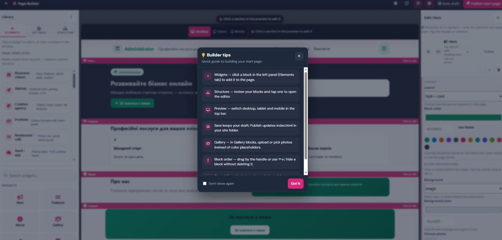

**Мови:** [English](README.en.md) · [Українська](README.uk.md) · [Norsk](README.no.md) · [Русский](README.ru.md) · [Deutsch](README.de.md) · [Polski](README.pl.md) · [Svenska](README.sv.md) · [Lietuvių](README.lt.md)

# BILOHASH Landing Builder

**Жива демо:** https://bilohash.com/landing_builder/  
**Конструктор (без збереження на сервері):** https://bilohash.com/landing_builder/builder.php  
**30-денне встановлення:** https://bilohash.com/landing_builder/demo-install.php  

Візуальний конструктор лендінгів у стилі Elementor, витягнутий з hPanel [BILOHASH Hosting](https://bilohash.com/hosting/). Віджети drag-and-drop, адаптивний попередній перегляд, експорт `index.html` — WordPress не потрібен.

| Пакет | URL |
|---------|-----|
| GitHub | https://github.com/Ruslan-Bilohash/landing_builder |
| Docker | `ghcr.io/ruslan-bilohash/landing_builder:latest` |
| Демо ZIP | GitHub Release `landing-builder-demo-30d-*.zip` |

## Скріншоти

### Головний конструктор — віджети, структура, живе полотно


### Редактор блоків і налаштування теми



### Опублікований HTML-вивід


## Можливості

- **40+ віджетів** — hero, features, галерея, ціни, FAQ, слайдер, месенджери, CTA, команда та інше
- **Шаблони сторінок** — бізнес, портфоліо, ресторан, події
- **Адаптивний попередній перегляд** — полотно desktop, tablet, mobile
- **Експорт HTML** — завантаження готового `index.html` для будь-якого хостингу
- **Теми** — 12 акцентних кольорів, набори іконок, стилі nav/footer
- **Жива демо** — зміни зберігаються в браузері (`localStorage`); без збереження на сервері
- **Багатомовний інтерфейс** — англійська, українська, норвезька (рядки конструктора з панелі Hosting)

## vs Business Landing CMS

| | **Landing Builder** (цей репозиторій) | **Business Landing CMS** (`lending`) |
|---|-------------------------------|--------------------------------------|
| Фокус | Візуальний блочний конструктор, швидкі односторінкові сайти | Повноцінна CMS: пресети, адмінка, ліди, інвойси |
| Збереження | Експорт HTML / чернетка в браузері | База даних + адмін-панель |
| Демо | https://bilohash.com/landing_builder/builder.php | https://bilohash.com/lending/ |

## Швидкий старт

### Жива демо (без встановлення)

Відкрийте `/builder.php` на демо-сайті. Використовуйте **Export HTML**, щоб завантажити сторінку.

### Docker

```bash
docker run --rm -p 8080:80 ghcr.io/ruslan-bilohash/landing_builder:latest
# http://localhost:8080/builder.php
```

### Вбудований PHP-сервер

```bash
git clone https://github.com/Ruslan-Bilohash/landing_builder.git
cd landing_builder
php -S localhost:8080
```

### Інтеграція з Hosting hPanel

Той самий движок входить до **BILOHASH Hosting** у `panel/landing-builder.php` з Save/Publish у `public_html/{user}/index.html`.

## 30-денна демо-ліцензія

Завантажте підписаний ZIP з GitHub Releases або з [кабінету клієнта BILOHASH](https://bilohash.com/ecosystem/cabinet.php?product=landing_builder).  
Період оцінювання: **30 днів**. Продакшн: info@bilohash.com

## Екосистема

Частина [екосистеми BILOHASH CMS](https://bilohash.com/ecosystem/join.php) — Shop, Booking, Hosting, Faktura, Tavle, Freelance та інше.

## Ліцензія

**Лише некомерційне використання** — можна переглядати, вивчати, форкати та запускати демо для особистого навчання та оцінювання.

**Комерційне використання потребує платної ліцензії BILOHASH** (сайти клієнтів, SaaS, перепродаж, продакшн понад 30-денне демо).

- [LICENSE](../../LICENSE) (англійською)
- [LICENSE-uk.md](../../LICENSE-uk.md) · [LICENSE-ru.md](../../LICENSE-ru.md) · [LICENSE-no.md](../../LICENSE-no.md) · [LICENSE-de.md](../../LICENSE-de.md) · [LICENSE-pl.md](../../LICENSE-pl.md) · [LICENSE-sv.md](../../LICENSE-sv.md) · [LICENSE-lt.md](../../LICENSE-lt.md)

Контакт: [rbilohash@gmail.com](mailto:rbilohash@gmail.com) · [ecosystem/join.php](https://bilohash.com/ecosystem/join.php)